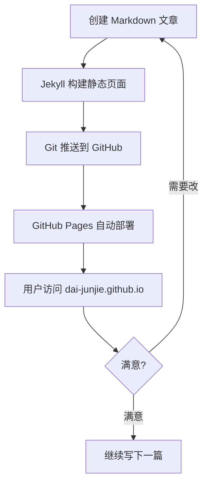

这是博客的第一篇示例文章。

## 为什么先做这个

- 先验证 Hexo 脚手架能正常生成页面
- 先验证 GitHub Pages 的发布链路是通的
- 后面再换主题、补页面、改样式

## 博客搭建流程


```mermaid
graph TD
    A[创建 Markdown 文章] --> B[Jekyll 构建静态页面]
    B --> C[Git 推送到 GitHub]
    C --> D[GitHub Pages 自动部署]
    D --> E[用户访问 dai-junjie.github.io]
    E --> F{满意?}
    F -->|需要改| A
    F -->|满意| G[继续写下一篇]
```

## 本地预览

```bash
bundle exec jekyll serve
```

打开 `http://localhost:4000` 就能看到站点。
